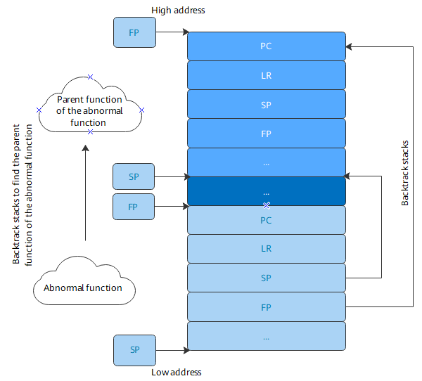

# Overview

## Basic Concepts

Exception management refers to a series of actions taken by the OS to handle exceptions \(chip hardware exceptions\) that occur during the running of the OS, for example, printing the call stack information of the current function, CPU information, and task stack information when an exception occurs.

As a commissioning method, exception management provides useful exception information such as the exception type and system status when an exception occurs, to help you locate and analyze faults.

When an exception occurs, Huawei LiteOS displays the information about the running task \(including the task name, task ID, and stack size\) and CPU information. For some chips with the RISC-V architecture that have high requirements on the memory size, Huawei LiteOS provides the small feature macro LOSCFG\_ARCH\_EXC\_SIMPLE\_INFO \(location in  **menuconfig**:  **Kernel**  \>  **Exception Management**  \>  **Enable Exception Simple Info**\) to tailor redundant exception prompt character strings. However, all information about the CPU operating environment when an exception occurs is retained.

## Operation Mechanism

Each function has its own stack space, which is called stack frame. When the function is called, the stack frame of the subfunction is created, and the input parameters, local variables, and registers of the function are put into the stack. The stack frame grows from a high address to a low address.

The ARM32 CPU architecture is used as an example. Each stack frame stores the historical values of the program counter \(PC\), link register \(LR\), stack pointer \(SP\), and frame point \(FP\) registers.

**Stack Analysis**

-   The LR points to the return address of the function.

-   R11 can be used as a general register. When specific compilation options are enabled, it can be used as an FP to implement the stack backtracking function.

    By default, the GNU compiler collection \(GCC\) uses R11 as the general register for storing variables. Therefore, the stack backtracking function of the FP cannot be used by default. To support the call stack parsing function, the -fno-omit-frame-pointer option needs to be added to the compilation parameters to ask the compiler to use R11 as the FP.

-   The FP points to the stack frame start address of the parent function of the current function. The stack frame of the parent function can be obtained by using the FP. The stack frame of the grandparent function can be obtained by obtaining the FP of the parent function from the stack frame. By analogy, the call stack of the program can be traced to obtain the call relationship between functions.

    When an exception occurs in the system, the system prints the register content saved in the stack frame of the abnormal function and the LR and FP register content in the stack frame of the parent function and grandfather function. You can trace the call relationship between functions and locate the exception cause based on the content.

The actual stack information varies depending on the CPU architecture. The following figure shows the stack analysis principle, which is for reference only.

**Figure  1**  Stack analysis principle 

In the figure, the registers in different colors indicate different functions. The register is saved when the function is called. The FP register is used to backtrack the stacks to the parent function of the abnormal function, continue to parse the stacks based on the rule, and determine the function call relationship to facilitate problem locating.

