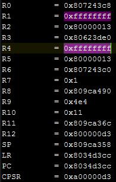
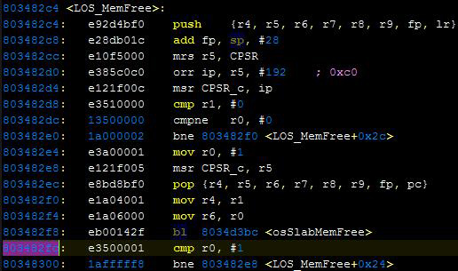

# Problem Locating Example<a name="EN-US_TOPIC_0311018402"></a>

On an ARM32 platform, the memory is released through an error, which triggers a system exception. After the system is suspended due to the exception, the information about the exception call stack and key registers can be viewed through the serial port, shown as below.  **excType**  indicates the exception type. The value  **4**  indicates that the data is terminated abnormally. For other values, see the chip manual. The information will help you locate the function where the exception occurs and call stack relations of the function.

```
excType: 4
taskName = MNT_send
taskId = 6
task stackSize = 12288
excBuffAddr pc = 0x8034d3cc
excBuffAddr lr = 0x8034d3cc
excBuffAddr sp = 0x809ca358
excBuffAddr fp = 0x809ca36c
*******backtrace begin*******
traceback 0 -- lr = 0x803482fc
traceback 0 -- fp = 0x809ca38c
traceback 1 -- lr = 0x80393e34
traceback 1 -- fp = 0x809ca3a4
traceback 2 -- lr = 0x8039e0d0
traceback 2 -- fp = 0x809ca3b4
traceback 3 -- lr = 0x80386bec
traceback 3 -- fp = 0x809ca424
traceback 4 -- lr = 0x800a6210
traceback 4 -- fp = 0x805da164
```

To locate the exception, perform the following steps:

1.  Open the .asm disassembly file generated after compilation. By default, the file is generated in the  **Huawei\_LiteOS/out/**_<Platform name\>_  directory.
2.  Search for the position of the PC  **8034d3cc**, in the ASM file. \(**0x**  needs to be removed.\)

    The PC address points to the command that the program is executing when the exception occurs. In the ASM file of the currently executed binary file, search for the PC value  **8034d3cc**  and find the command line that is being executed by the CPU. The result is shown in the following figure.

    

    You can obtain the following information from the figure above:

    1.  The CPU is executing the  **ldrh r2, \[r4, \#-4\]**  command when the exception occurs.
    2.  The exception occurs in the osSlabMemFree function.

    According to the analysis, the  **ldrh**  command is used to read a value from the memory address \(r4-4\) and load the value to the register r2. Then, check the value of r4 based on the register information printed when the exception occurs. The following figure shows the register information printed when the exception occurs. The value of r4 is  **0xffffffff**.

    

    The r4 value exceeds the memory range, and therefore a data termination exception occurs while the CPU is executing the command. According to the ASM file, r4 is moved from r1, and r1 is the second input parameter of the function. Therefore, the incorrect input parameter  **0xffffffff**  \(or  **-1**\) is input when the osSlabMemFree function is called.

    Next, you need to find out the caller of the osSlabMemFree function.

3.  Search for the call stack based on the LR value.

    The call stack information starts from backtrace begin of the printed exception information. Search for the LR corresponding to  **backtrace 0**  in the ASM file, as shown in the following figure.

    

    The figure shows that the LOS\_MemFree function calls the osSlabMemFree function. By using this method, you can find that the call relationships between functions are MNT\_buf\_send \(service function\) -\> free -\> LOS\_MemFree -\> osSlabMemFree.

    By checking the implementation of MNT\_buf\_send, the problem of incorrectly using a pointer is found. This problem causes an incorrect address to be freed. As a result, the exception occurs.


